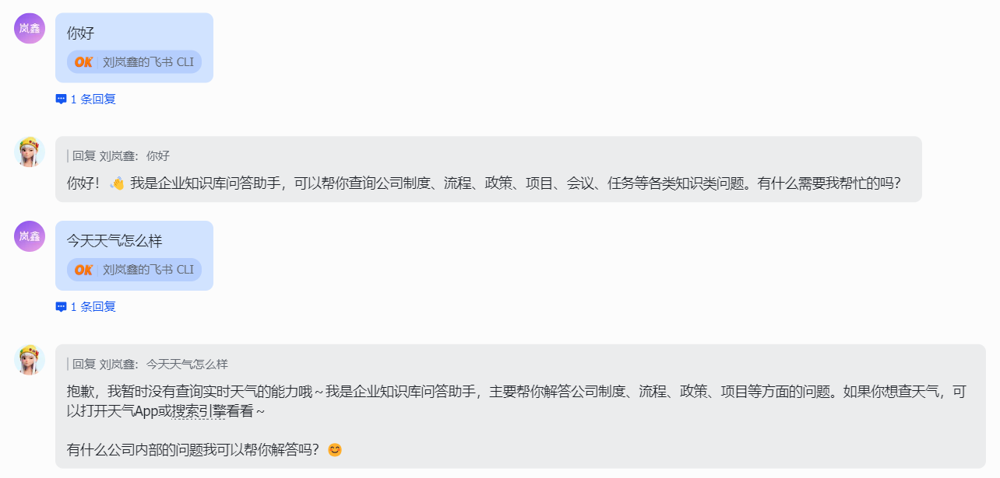

# Lark Agent

Lark Agent 是一个面向 Lark/飞书的企业 Agent 助手。它可以回答企业知识库问题，也可以通过 MCP 查询业务数据、搜索公开网页、保持多轮上下文，并支持把多源文档持续入库到可检索的知识库。

这个项目不是单纯的 RAG 问答链路。RAG 是 Agent 的一个工具能力；Agent 会根据问题自主判断是直接回答、检索知识库、调用业务数据库 MCP，还是搜索网页补充信息。

## 项目能力

- **Agent 助手运行时**：基于 LangGraph + Function Calling 构建多轮工具调用循环，支持工具轮次上限、末轮强制作答和来源感知的最终回答。
- **知识库检索工具**：支持 Dense 向量检索、BM25、RRF 融合、Cross-Encoder 精排、父子召回和答案来源引用。
- **业务数据库 MCP**：将库存查询、批量库存查询、订单状态、商品查询封装成固定语义工具，供当前 Agent 和其他项目复用。
- **搜索/网页 MCP**：封装公开网页搜索与网页正文读取能力。
- **运行时 Skill**：用 Markdown 沉淀工具调用流程，只有当前问题命中对应场景时才注入本轮上下文。
- **飞书接入**：支持私聊、群聊 @、消息去重、快速 ack、反馈入口和群文件下载。
- **飞书流式卡片**：可选启用 JSON 2.0 流式答案卡片，先回复处理中状态，并持续显示理解问题、检索知识库、调用工具和生成答案等阶段；最终答案通过 LLM SSE 边生成边更新到同一张卡片，内置节流器合并过碎输出，降低飞书接口频控风险，并保留反馈入口。
- **多源文档入库**：支持飞书云文档、PDF、Word、PPT、Excel、图片、JSON、Markdown、纯文本等格式转换、清洗、切片、向量化和写入 Qdrant。
- **多轮记忆**：支持改写历史、回答上下文窗口、摘要、TTL/LRU 清理和可选 SQLite 持久化。
- **Redis 能力预留**：支持业务查询限流使用 Redis 做跨进程状态；后续也可扩展问答缓存和轻量队列。
- **质量评估**：支持 Ragas 评估 answer faithfulness、relevance、correctness 和 retrieval quality。
- **可选 HTTP API**：提供召回、向量化和文档转换接口，方便其他系统接入。

## 设计优势

这个项目面向的是企业助手场景：既要回答知识库问题，也要查询业务数据，还要避免工具边界混乱和数据库压力失控。

- **工具选择更清晰**：由 Function Calling 负责工具选择，代码侧控制每一轮哪些工具可见。
- **业务工具可复用**：业务数据库能力通过 MCP 暴露，其他 Agent 项目也能复用同一套工具。
- **工具数量克制**：外部 MCP 只规划业务数据库和搜索/网页两类，减少工具误选。
- **避免模型生成 SQL**：Agent 只传结构化业务参数，SQL 或查询模板留在业务数据库服务侧。
- **业务数据访问更稳**：业务数据库工具只在授权用户私聊中暴露，群聊场景不会出现这些工具。
- **成本与负载可控**：业务查询调用前限制时间窗口、调用频率和最大返回行数。
- **Skill 化工具策略**：业务数据库调用规则写入 Markdown Skill，统一约束触发条件、必填参数、澄清追问和不可猜字段。
- **上下文不污染**：Skill 只在当前问题命中时临时注入，本轮结束后不写入 memory。
- **入库链路完整保留**：知识入库管线放在 `knowledge/ingestion`，后续新数据仍可以持续入库。

## 架构

```text
飞书消息 / HTTP 请求
  -> app/channels/lark 或 app/api
  -> app/assistant
       -> 运行时 Skill 激活
       -> get_current_time
       -> search_knowledge
       -> 业务数据库 MCP
       -> 搜索/网页 MCP
  -> 带来源和反馈入口的回答

ops/scripts
  -> knowledge/ingestion
  -> MinIO 原文 / Markdown / chunk 对象
  -> Qdrant dense 和 sparse payload

knowledge/evaluation
  -> app/assistant + knowledge/retrieval
```

项目按五个领域组织：

| 目录 | 职责 |
| --- | --- |
| `app/` | 飞书接入、HTTP API、Agent 运行时、运行时 Skill、工具、记忆和答案格式化 |
| `knowledge/` | 文档入库、清洗、切片、检索和评估 |
| `infrastructure/` | 配置、模型客户端、对象/向量存储、MCP 客户端和服务端 |
| `ops/` | 运维脚本和项目资源 |
| `tests/` | 跨模块测试和架构边界测试 |

## Agent 工具

| 工具 | 来源 | 作用 |
| --- | --- | --- |
| `get_current_time` | 本地工具 | 为相对时间问题提供时间基准 |
| `search_knowledge` | `knowledge/retrieval` | 检索企业知识库 |
| `inventory_lookup` | 业务数据库 MCP | 查询单个 SKU 库存 |
| `inventory_batch_lookup` | 业务数据库 MCP | 批量查询多个 SKU 库存 |
| `order_status` | 业务数据库 MCP | 查询订单状态和节点 |
| `product_lookup` | 业务数据库 MCP | 按名称、SKU、关键词或分类查商品 |
| `web_search` / `web_fetch` | 搜索/网页 MCP | 搜索公开信息并读取网页正文 |

用户身份、检索器、MCP 客户端和连接配置都由代码注入，不作为模型参数暴露。

## 运行时 Skill

运行时 Skill 位于 [app/assistant/skills](app/assistant/skills/README.md)。当前已提供：

- [business_database_mcp.md](app/assistant/skills/business_database_mcp.md)：说明调用业务数据库 MCP 前应该如何判断场景、追问参数和组织回答。

激活流程：

```text
用户消息
  -> 关键词 / SKU / 订单号检测
  -> 私聊 + 用户白名单检查
  -> 将 Markdown Skill 注入本轮 Agent 上下文
  -> 执行 Function Calling 循环
  -> 本轮结束后丢弃 Skill 上下文
```

Skill 负责指导 Agent 在缺少 SKU、订单号、仓库、产品关键词或日期范围时先澄清。最终硬约束仍由代码执行：

- 仅私聊可用。
- 用户必须在 `BUSINESS_DB_MCP_ALLOWED_USERS` 白名单中。
- 单次查询时间窗口默认不超过 30 天。
- 单用户默认 60 秒最多 3 次业务查询。
- 可通过 `BUSINESS_DB_QUERY_GUARD_REDIS_URL` 使用 Redis 做跨进程限流。

## 配置

创建本地配置文件：

```powershell
Copy-Item .env.example .env
Copy-Item infrastructure/conf/config_local.yaml.example infrastructure/conf/config_local.yaml
```

真实配置只写入 `.env` 和 `infrastructure/conf/config_local.yaml` 等本地文件。仓库中只保留变量名、占位符和示例。

常见配置分组：

- 飞书应用凭据。
- 飞书回复形态：默认普通回复，可通过 `LARK_STREAMING_CARD_ENABLED=true` 开启流式卡片。
- LLM、embedding、rerank 和可选 OCR/VLM 服务。
- MinIO 和 Qdrant。
- Agent 工具轮次、召回阈值和飞书 worker 并发。
- 业务数据库 MCP 和搜索/网页 MCP。
- 运行时 Skill 开关。
- 可选 SQLite 对话记忆持久化。

环境变量说明见 [infrastructure/conf/README.md](infrastructure/conf/README.md)。

## 启动依赖

本地启动 MinIO 和 Qdrant：

```powershell
docker compose up -d
```

也可以在 `.env` 中指向已有服务。

## 启动飞书 Agent

```powershell
python -m app.channels.lark.bot
```

飞书通道使用长连接接收事件，因此 bot 进程不需要公网回调入口。

## 文档入库

上传本地文件或目录：

```powershell
python -m ops.scripts.upload_files --path <file-or-directory>
```

下载飞书群文件：

```powershell
python -m app.channels.lark.download --chat-id <chat-id> --target minio
```

运行入库管线：

```powershell
python -m knowledge.ingestion.orchestrator.knowledge_pipeline
```

写入 Qdrant：

```powershell
python -m ops.scripts.chunk_minio_to_qdrant --collection <collection> --prefix <chunk-prefix>
```

命令行测试召回：

```powershell
python -m ops.scripts.recall_cli "<question>" --collection <collection>
```

## 启动 MCP 服务

项目提供两个聚焦的 MCP 服务：

- **业务数据库 MCP**：`inventory_lookup`、`inventory_batch_lookup`、`order_status`、`product_lookup`。
- **搜索/网页 MCP**：`web_search`、`web_fetch`。

```powershell
python -m infrastructure.mcp.servers.business_db
python -m infrastructure.mcp.servers.web_search
```

MCP 地址、监听 host/port/path、鉴权、后端连接和工具白名单全部通过环境变量配置。详见 [infrastructure/mcp/README.md](infrastructure/mcp/README.md)。

## 可选 HTTP API

飞书 Agent 主链路不依赖这个 API；它主要给其他系统调用召回、向量化或文档转换能力：

```powershell
uvicorn app.api.main:app --port <port>
```

## 评估

使用本地测试集运行 Ragas 评估：

```powershell
python -m knowledge.evaluation.run_eval --testset <testset-path> --collection <collection>
```

测试集格式和指标说明见 [knowledge/evaluation/README.md](knowledge/evaluation/README.md)。真实业务问题和评估输出不应提交到仓库。

## 测试

```powershell
python -m pytest -q
```

如果 Windows 默认 pytest 临时目录权限异常，可以使用项目内临时目录：

```powershell
python -m pytest -q --basetemp .pytest_tmp
```

测试覆盖 Agent 工具循环、运行时 Skill 激活、对话记忆、工具调用 payload、文档转换、清洗、切片、检索、MCP 服务、业务查询 guard 和架构边界。

## 项目结构

```text
lark-agent/
├── app/
│   ├── assistant/          Agent 运行时、工具、运行时 Skill、记忆和提示词
│   ├── channels/lark/      飞书事件处理、回复、反馈和文件下载
│   └── api/                可选 FastAPI 接口
├── knowledge/
│   ├── ingestion/          转换、清洗、切片和入库编排
│   ├── retrieval/          混合召回、过滤、精排和结果解析
│   ├── evaluation/         Ragas 评估
│   └── utils/              知识处理公共工具
├── infrastructure/
│   ├── conf/               配置加载和环境变量插值
│   ├── db/                 MinIO 和 Qdrant 客户端
│   ├── model/              LLM、embedding、rerank、OCR 客户端
│   └── mcp/                MCP 服务、客户端、鉴权和配置工具
├── ops/
│   ├── scripts/            运维命令入口
│   └── docs/               截图和项目资源
└── tests/                  跨模块测试
```

更多模块说明：

- [app](app/README.md)
- [knowledge](knowledge/README.md)
- [infrastructure](infrastructure/README.md)
- [ops](ops/README.md)
- [tests](tests/README.md)

## 数据与边界

- 企业文档原文和中间产物存储在 MinIO，检索 payload 和向量存储在 Qdrant。
- 对话记忆按会话隔离，可使用内存或 SQLite 持久化。
- 业务数据库 MCP 只接受明确业务参数，不暴露任意 SQL 生成。
- 业务数据库 MCP 工具只在授权私聊中暴露。
- 网页读取会拒绝本地/内网地址、带凭据 URL 和非文本响应。
- 真实连接值和凭据通过环境变量或被忽略的本地文件注入。

## 截图

知识库回答会包含来源路径和反馈入口：


不需要工具的问题可以直接回答：



## License

[MIT](LICENSE)
